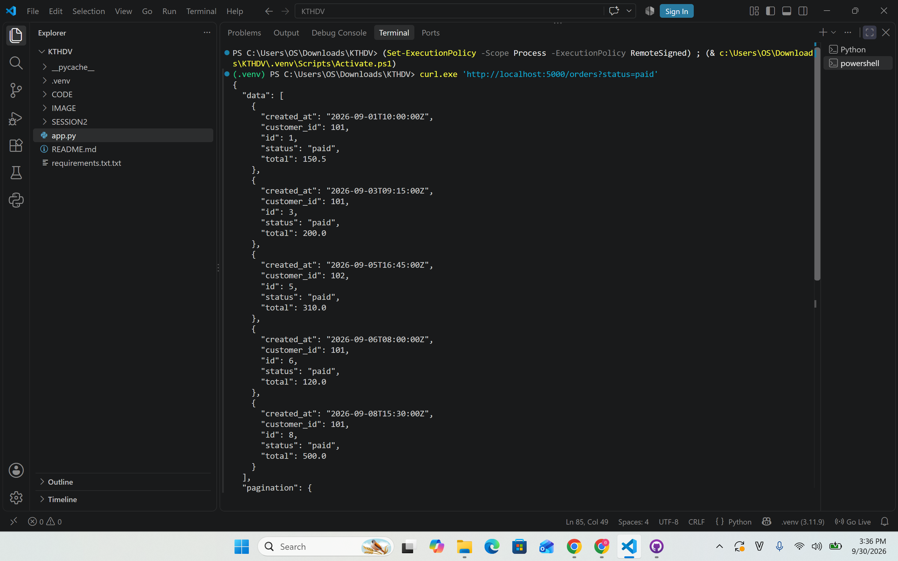
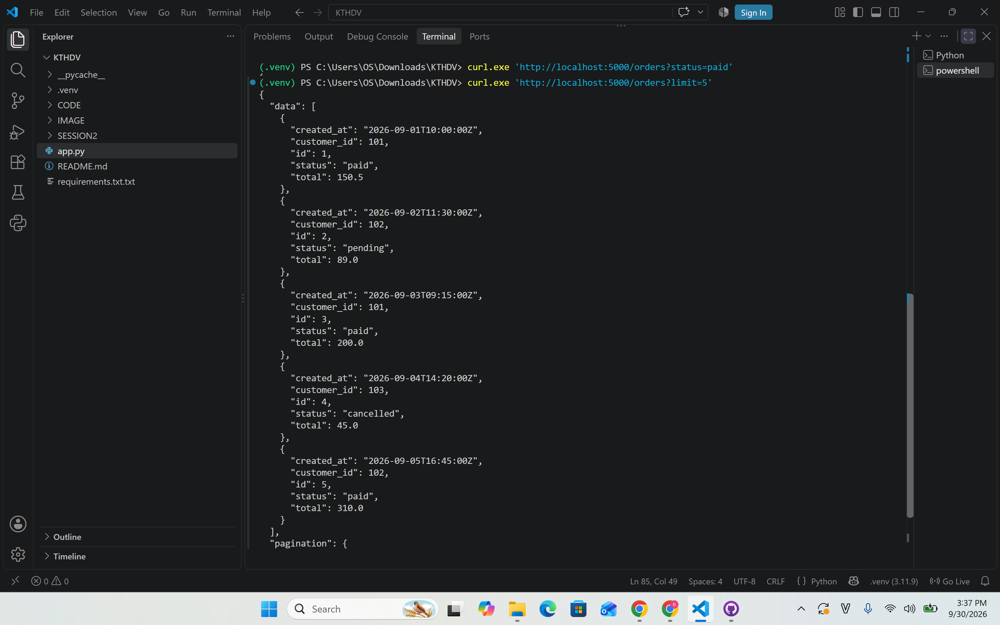
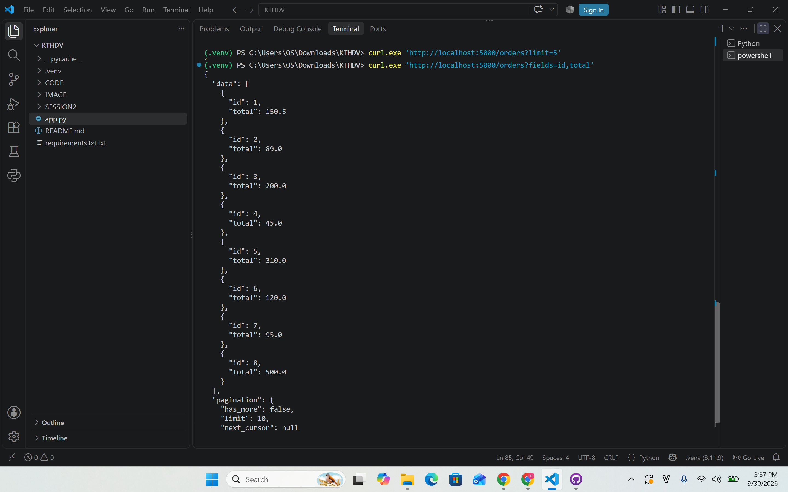
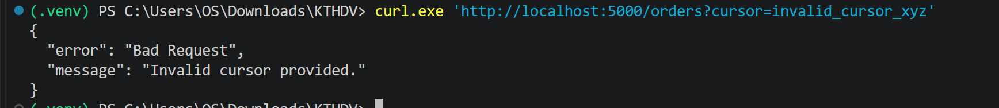

### Kết quả kiểm thử API Orders 

1. Lọc đơn hàng theo trạng thái (status=paid)

2. Phân trang theo giới hạn số lượng (limit=5)

3. Lựa chọn trường hiển thị (fields=id,total)

4. Lỗi Con trỏ không hợp lệ (400 Bad Request)
